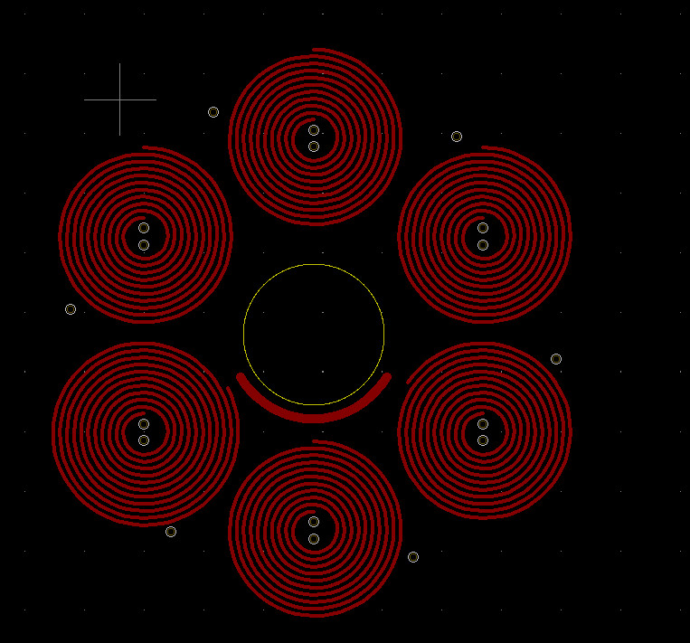
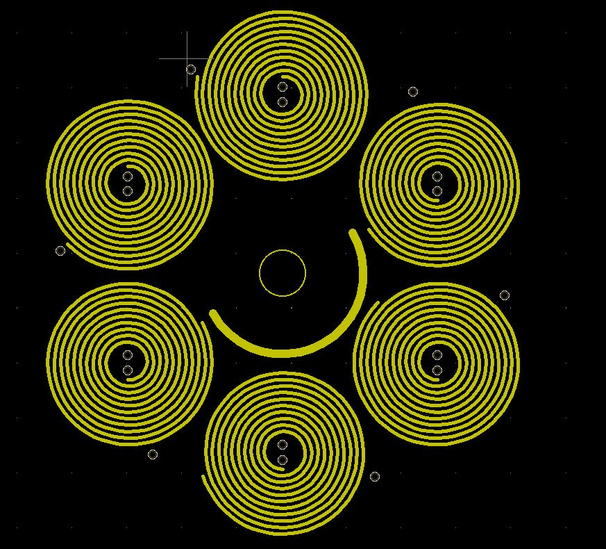

# PCB Motors

Packages to generate a PCB motor, Carl Bugeja style, for KiCad using Python

## History

Carl Bugeja shared several projects where eletric motors are made directly using PCBs,
see [Hackaday](https://hackaday.io/CarlBugeja) and [Youtube](https://www.youtube.com/c/CarlBugeja).
Drawing these circuits can be a pain. This scripts automates the fabrication.
The scripts only supports Archimidean spirals. Trapezoids are a more popular choise and most likely work better.
An implementation/plugin for kicad can be found [here](https://github.com/atomic14/kicad-coil-plugins).

## Install
Install poetry and python
```console
sudo apt install python3 python3-pip
curl -sSL https://raw.githubusercontent.com/python-poetry/poetry/master/get-poetry.py | python3 -
```
Use poetry to install the dependencies in pyproject.toml
```console
poetry install
```
Change parameters in the script and run it
```console
poetry run python spiral.py
```
The script modifies the base_kicad_pcb and creates a spiral.kicad_pcb.
This can be opened with KiCad and should contain the motor.
This design can be attached to another pcb via Kicad PCB import method.
This feature is only available if KiCad PCB is run in standalone mode. Disable the rat's net before doing so.
At the moment, the user still needs to add connect the coils using the via's.  
It can also be useful to change set the net to the same number as the one you plan to use in the final layout.

## Working of the motor

The magnetic field of a circular ring is shown below;
.
The commutation and switching of motor is outlined [here](https://www.mathworks.com/help/mcb/ref/sixstepcommutation.html).  A [pancake motor](https://www.motioncontroltips.com/faq-servo-pancake-motors-work/) provides an alternative implementations of a PCB motor.  It was not used as there is no open source design available.

## Ideal number of stator magnets
The optimal number of magnets can be found from this document and goes into depth in the winding factor
https://things-in-motion.blogspot.com/2019/01/selecting-best-pole-and-slot.html.
The information is based off the paper 'Distribution, coil-span and winding factors for PM machines with concentrated windings' by S.E Skaar et al. and the book 'Design of Brushless Permanent-magnet Machines' by J. R. Hendershot and T. Miller. See the 'recommended reading' list above for more information on this book. The emotor.com glossary page is also useful for reference.
 

## Some facts & equations
Standard grade neodymium magnets have a maximum operating temperature of 80 degrees [Celsius](https://www.magnetexpert.com/technical-advice-for-every-application-magnet-expert-i685/temperature-effects-on-magnets-i683).  
Force between two magnets follows a square [law](https://en.wikipedia.org/wiki/Force_between_magnets), ideally the PCB is thin!  
Heat generated by the PCB equals $P=R \cdot I^2$, here P is power, I is current and R is resistance of the coil.  
  
The resistance of a PCB trace is;  
$R = \frac{\rho L}{T W}(1 + \alpha (T_{amb} – 25))$   
Here, R is the resistance; L is the length of the trace; T is the thickness of the trace;
W is the width of the trace and Tamb is the ambient temperature in Celcius.
Alpha is the resistivity of copper which is 0.39 percent for each [degree](https://www.cirris.com/learning-center/general-testing/special-topics/177-temperature-coefficient-of-copper).  
Torque is defined as $\tau = F \cdot R$, if the magnets are further away from the center you can excert more force. 
The magnetic field produced at the centre of a current-carrying coil of 𝑁 turns is;  
$B=\frac{\mu N I}{2R}$, here 𝐼 is the current in the solenoid, $\mu$ is the magnetic permeability and R is the [radius](https://physics.stackexchange.com/questions/355140/magnetic-field-due-to-a-coil-of-n-turns-and-a-solenoid).


## Results

Script creates a 4 layer PCB motor with 6 poles.
The front copper layer is shown below,  
  
The In1.Cu layer is shown below. The style of these connections is named "Carl Bugeja" styled PCBs.  
  

## Video

A voltage of 5V was applied over the board. The current reached 0.7 amps. Over time the temperature of the
board stabilized at 60 degrees Celcius.

[](https://youtu.be/r3wv7XpXPck)

## Control software

Gateware to pulse the motor can be found [here](https://github.com/hstarmans/hexastorm/tree/master/tests/custommotor).
